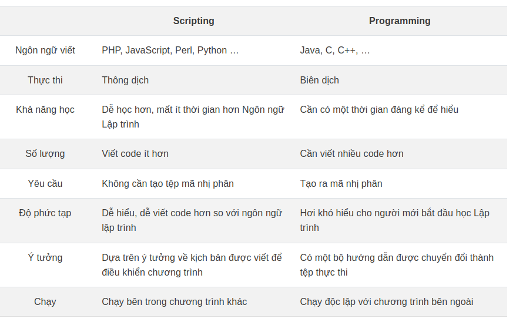
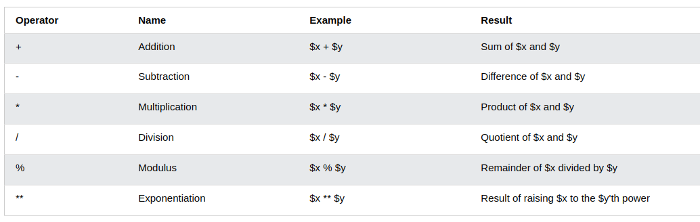
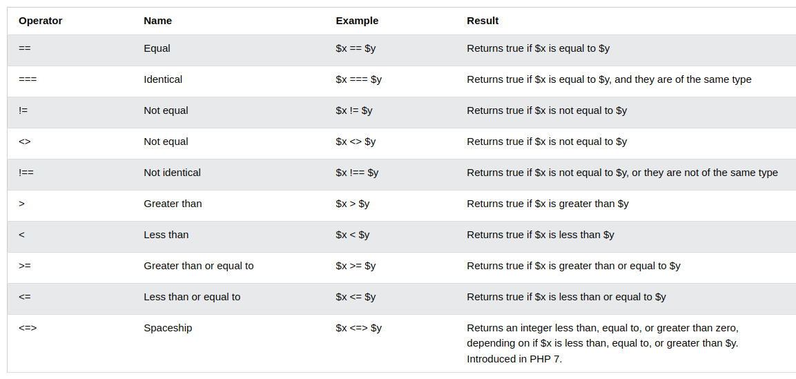
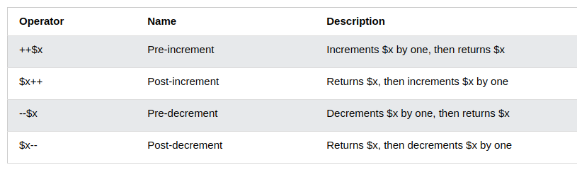

# PHP basic

## Introduction to Web technology
- Công nghệ web là một thuật ngữ chung đề cập đến nhiều ngôn ngữ và gói đa phương tiện được sử dụng kết hợp với nhau, để tạo ra các trang web. Mỗi công nghệ có chức năng riêng biệt và cần yêu cầu sử dụng kép ít nhất thêm một công nghệ khác. Do đó, có thể nói rằng tất cả các thành phần tạo nên một trang web phụ thuộc lẫn nhau.
  

## Introduction HTML5 and CSS
1. HTML
- HTML là gì? Là chữ viết tắt của Hyper Text Markup Language, tạm dịch là ngôn ngữ đánh dấu siêu văn bản và được sử dụng phổ biến trên Word Wide Web.
- HTML5 là phiên bản thứ 5 của HTML, cải tiến với nhiều tính năng hơn để mọi người có thể truy cập internet dễ dàng hơn, các Lập trình viên Lập trình trang Web nhanh chóng, hiệu quả hơn.
2. CSS
- CSS là gì?  Là viết tắt của Cascading Style Sheets, là dạng ngôn ngữ đi tìm và định dạng lại các phần tử được tạo ra bởi ngôn ngữ đánh dấu như HTML.
- Có 3 cách viết CSS: inline, internal, external.

## Script:
- Script (còn được gọi là ngôn ngữ kịch bản hoặc Scripting) là một chuỗi các lệnh có thể được thực hiện mà không cần biên dịch.
- Mặc dù tất cả các Script đều là ngôn ngữ lập trình, nhưng không phải tất cả các ngôn ngữ lập trình đều là ngôn ngữ Script. PHP, Perl và Python là những ví dụ phổ biến cho ngôn ngữ Script.
- Script sử dụng một chương trình được gọi là trình thông dịch để dịch các lệnh và được thông dịch trực tiếp từ mã nguồn, không yêu cầu bước biên dịch.
- Ưu Điểm:
  - Nguồn mở, cho phép người dùng xem và chỉnh sửa tập lệnh nếu cần. Không tạo ra một tệp thực thi và cho phép các lệnh cấp cao được chuyển đổi thành ngôn ngữ máy ngay lập tức.
  - Phát triển nhanh hơn nhiều so với ngôn ngữ lập trình và chi phí bảo trì ít hơn.
- Nhược điểm:
- Script yêu cầu người dùng phải cài đặt trình thông dịch hoặc chương trình riêng biệt trước khi tập lệnh có thể chạy. Trong một số trường hợp, các lệnh của Script có thể chậm hơn một chương trình được biên dịch.
- Ứng dụng: được sử dụng trong nhiều lĩnh vực, đặc biệt là trong lĩnh vực thiết kế website.
- So sánh:

## nginx:
- NGINX hay còn được viết cách điệu là NGIИX, là một web server mã nguồn mở vô cùng mạnh mẽ và nổi tiếng phục vụ web HTTP. Với NGIИX sử dụng kiến thức đơn luồng, (event-driven) không đồng bộ (asynchronous) để có hiệu suất và sự ổn định tối đa và là lựa chọn ưa chuộng hơn Apache server. Nó có thể phục vụ các công việc như như load balancing, HTTP caching, hay sử dụng như một reverse reverse proxying, media streaming và email proxy như IMAP, POP3, và SMTP….
- Trước khi tìm hiểu cách thức hoạt động của NGINX thì chúng ta cần biết cách web server hoạt động thế nào. Ví dụ, khi có một người nào đó gửi yêu cầu mở một trang web, trình duyệt sẽ liên lạc với server chứa website đó. Sau đó, server sẽ tìm kiếm đúng file được yêu cầu của trang đó và gửi ngược lại về cho server. Đây được xem là một loại truy vấn đơn giản nhất.
- Các máy chủ web truyền thống tạo một luồng duy nhất cho mọi yêu cầu, nhưng Nginx không hoạt động theo cách đó. Nginx thực hiện với kiến trúc hướng sự kiện không đồng bộ. Điều đó có nghĩa là các luồng tương tự được quản lý theo một worker process và mỗi worker process chứa các đơn vị nhỏ hơn gọi là worker connection. Toàn bộ các đơn vị này sau đó chịu trách nhiệm xử lý các luồng yêu cầu. Worker connection cung cấp các yêu cầu cho worker process, cũng sẽ gửi nó đến master process. Cuối cùng, master process cung cấp kết quả của những yêu cầu đó.
- apache vs nginx:
  - Apache là chương trình máy chủ HTTP mã nguồn mở dành cho máy chủ đối thoại qua giao thức HTTP, trong khi NGINX là máy chủ web không đồng bộ hiệu suất cao.
  - Hỗ trợ, sửa lỗi và phát triển của Apache được quản lý và duy trì bởi một cộng đồng người dùng lớn trên khắp thế giới. Còn về NGINX thì hỗ trợ và bảo trì của NGINX được thực hiện bởi một doanh nghiệp chủ quản riêng biệt.
  - Với NGINX có thể xử lý nhiều kết nối, còn với Apache, một luồng chỉ được liên kết với một kết nối.
  - cả NGINX và Apache đều có thể hỗ trợ chạy trên nhiều hệ điều hành hỗ trợ hệ thống Unix. Tuy nhiên, hiệu năng của NGINX trên Windows vẫn thật sự chưa tốt như trên các nền tảng khác.
  - NGINX có thể đồng thời chạy lên đến 1.000 kết nối nội dung tĩnh nhanh hơn gấp 2 lần so với Apache và tiết kiệm bộ nhớ hơn một chút.

## PHP-FPM:
- PHP-FPM là chương trình có chức năng phiên dịch php khi chạy trang web cho web server cho phép tăng tốc PHP lên gấp nhiều lần, đặc biệt phù hợp với các web server có lưu lượng truy cập lớn.
- web stacks: là tập hợp các công nghệ , ứng dụng phần mềm thường dùng để phát triển các ứng dụng web, thực hiện các trang web.

## PHP Introduction
- Ngôn ngữ PHP là từ viết tắt của Personal Home Page (hiện nay là Hypertext Preprocessor). Thuật ngữ này chỉ chuỗi ngôn ngữ kịch bản hay mã lệnh, phù hợp để phát triển cho các ứng dụng nằm trên máy chủ.

- Khi viết phần mềm bằng ngôn ngữ PHP, chuỗi lệnh sẽ được xử lý trên server để từ đó sinh ra mã HTML trên client. Và dựa vào đó, các ứng dụng trên website của bạn sẽ hoạt động một cách dễ dàng.
Người ta thường sử dụng PHP trong việc xây dựng và phát triển các ứng dụng website chạy trên máy chủ. Mã lệnh PHP có thể nhúng được vào trang HTML bằng cách sử dụng cặp thẻ PHP.

- Nhờ đó, website bạn phát triển dễ dàng kết nối được với các website khác trên hệ thống mạng internet.

- PHP cũng là ngôn ngữ lập trình mã nguồn mở và miễn phí. PHP tương thích với nhiều nền tảng khác nhau như Windows, MacOS và Linux, v.v.

## PHP Syntax
1. Cú pháp PHP chuẩn

- Một tập lệnh PHP (đoạn mã) bắt đầu bằng thẻ <?php và kết thúc bằng thẻ ? >

```php
<?php
// Some code to be executed
echo "Hello, world!";
?>
```
- Mỗi câu lệnh PHP kết thúc bằng dấu chấm phẩy “;” – Điều này cho PHP Engine biết rằng đã kết thúc câu lệnh hiện tại.
2. Nhúng PHP vào HTML
- Các tệp PHP là các tệp văn bản đơn giản với phần đuôi mở rộng .php
- Bên trong tệp PHP, bạn có thể viết HTML giống như bạn làm trong các trang HTML thông thường cũng như nhúng mã PHP để thực thi phía máy chủ.
````php
<!DOCTYPE html>
<html lang="en">
<head>
    <meta charset="UTF-8">
    <title>A Simple PHP File</title>
</head>
<body>
    <h1><?php echo "Hello, world!"; ?></h1>
</body>
</html>
````
- Ví dụ trên cho thấy cách bạn có thể nhúng mã PHP trong HTML
3. PHP comment
- Một comment chỉ đơn giản là đoạn văn bản bị bỏ qua bởi PHP Engine. Mục đích của các comment là giải thích đoạn mã đang làm cái gì.
- PHP hỗ trợ comment dòng đơn cũng như các comment nhiều dòng. Để viết một comment một dòng ta bắt đầu với 2 dấu gạch chéo “//” và để viết comment nhiều dòng, hãy bắt đầu comment bằng dấu gạch chéo và theo sau là dấu hoa thị /* rồi kết thúc comment bằng dấu hoa thị theo sau là dấu gạch chéo */, ví dụ như sau:
````php
<?php
// comment 1 dòng 
/*
comment 
nhiều 
dòng
*/
?>
````

## PHP Datatypes
1. Kiểu int  (Dữ liệu kiểu số nguyên)
````php
<?php
    $int = 1234;
    // biến int được khai báo kiểu dữ liệu số nguyên với giá trị là 1234
?>
````
2. Kiểu String (Dữ liệu kiểu chuỗi)
````php
<?php
    $string = "Dang";
    echo $string;
    // biến string có kiểu dữ liệu là string với giá trị là "Dang"
?>
````
3. Kiểu Float hoặc Double (Dữ liệu kiểu số thập phân)
````php
<?php
    $float_1 = 1.234;
    $float_2 = 1/2;
    // biến float_1 và float_2 được khai báo kiểu dữ liệu float
?>
````
4. Kiểu Boolean
- nó chỉ chứa 2 giá trị là đúng hoặc sai (TRUE hoặc FALSE).
````php
<?php
    // có thể khai báo kiểu Boolean như sau 
    $x = true;
    $y = false;
?>
````
5. kiểu dữ liệu mảng (array)
- Mảng có thể lưu trữ nhiều giá trị trong 1 biến duy nhất.
````php
<?php
    $arr = array("Nguyen", "Doan", "Dang");
    // biến arr có kiểu dữ liệu dạng mảng với 3 giá trị
?>
````
6. Kiểu object
- Class và Object là khía cạnh thuộc về lập trình hướng đối tượng.
- Class là khuôn mẫu cho các Object và một Object là thể hiện của một Class.
- Các Object kế thừa tất cả thuộc tính và hành vi của Class nhưng mang những giá trị khác nhau.
````php
<?php
    // khai báo class Person
    class Person{
        // khai báo 2 thuộc tính của class là name và age
        public $name;
        public $age;

        // khai báo hàm khởi tạo của class
        public function __construct($name, $age)
        {
            $this->name = $name;
            $this->age = $age;
        }

        // khai báo phương thức cho class
        public  function getInfo(){
            return $this->name." ".$this->age;
        }
    }

    // khởi tạo object person_1 
    $person_1 = new Person("Dang", 22);
    echo $person_1->getInfo();
    
    //kq
    Dang 22
?>
````

## PHP Variables, Constants and Array
1. PHP Variables.
- Các biến được sử dụng để lưu trữ dữ liệu, như chuỗi văn bản, số, v.v … Các giá trị biến có thể thay đổi trong quá trình xử lý. Dưới đây là một số điều quan trọng cần biết về các biến:
  - PHP tự động chuyển đổi biến thành kiểu dữ liệu chính xác, tùy thuộc vào giá trị của nó.
  - Sau khi khai báo một biến, bạn có thể sử dụng biến để làm việc.
  - Toán tử gán “=” được sử dụng để gán giá trị cho một biến.
- Biến trong PHP có thể được khai báo như thế này: 
  - $var_name = value;
2. Constants.
- Constant (Hằng số) là tên hoặc mã định danh cho một giá trị cố định.
- Hằng số giống như các biến, nhưng chúng không thể định nghĩa hoặc thay đổi.
- Các hằng số được định nghĩa bằng hàm: define("Tên hằng số","Giá trị").
3. Array
- Mảng là các biến phức tạp cho phép chúng ta lưu trữ nhiều hơn một giá trị hoặc một nhóm các giá trị dưới một tên biến duy nhất.
- Có ba loại mảng trong PHP mà bạn có thể tạo. Đó là:
  - Indexed Array – Một mảng có number key.
  - Associative array (Mảng kết hợp) – Một mảng trong đó có key và value riêng
  - Multidimensional array (Mảng đa chiều) – Một mảng chứa một hoặc nhiều mảng trong chính nó.
- khai báo mảng:
- $ten_mang = array('a','b','c'); hoặc $ten_mang = ["a","b","c",];

## PHP Operator
1. Toán tử số học (Arithmetic Operator) trong PHP
- Các toán tử số học được sử dụng để thực hiện các phép toán số học phổ biến, chẳng hạn như cộng, trừ, nhân, chia v.v …

2. Toán tử gán (Assignment Operator) trong PHP
- Các toán tử gán được sử dụng để gán giá trị cho các biến.:
3. Toán tử so sánh (Comparison Operator) trong PHP
- Các toán tử so sánh được sử dụng để so sánh hai giá trị theo kiểu ĐÚNG hoặc SAI (Kiểu Boolean)

4. Các toán tử tăng và giảm trong PHP
- Các toán tử tăng (++) / giảm (–) được sử dụng để tăng / giảm giá trị của một biến.

5. Toán tử Logic (Logical Operator) trong PHP
- Các toán tử logic thường được sử dụng kết hợp trong các câu lệnh có điều kiện.

6. Toán tử chuỗi (String Operator) PHP
- Có hai toán tử được thiết kế riêng dành cho chuỗi trong PHP là . và .=

## Control Structures
1. if else
- Câu lệnh điều kiện if else cho phép ta thay đổi luồng của chương trình dựa trên một điều kiện nào đó. Nếu điều kiện là đúng (true) thì chương trình sẽ được thực hiện, ngược lại nếu điều kiện đưa ra là sai (false) thì nội dung công việc đó sẽ không được thực hiện.
```php
if(điều kiện){
    // Code thực thi nếu điều kiện đúng
} else{
    // Code thực thi nếu điều kiện sai
}
```
2. else if
- Câu lệnh if…elseif…else là một câu lệnh đặc biệt được sử dụng để kết hợp nhiều câu lệnh if … khác nhau.
```php
if(điều kiện 1){
    // Code thực thi nếu điều kiện 1 True
} elseif(điều kiện 2){
    // Code thực thi nếu điều kiện 1 False và điều kiện 2 True
} else{
    // Code thực thi nếu cả điều kiện 1 và điề kiện 2 đều sai
}
```
3. switch case.
- Câu lệnh Switch…Case kiểm tra một biến đối với một loạt các giá trị cho đến khi tìm thấy khớp, và sau đó thực thi khối mã tương ứng với khớp đó.
```php
switch(n){
    case label1:
        // Code thực thi nếu n=label1
        break;
    case label2:
        // Code thực thi nếu if n=label2
        break;
    ...
    default:
        // Code thực thi nếu n không thuộc tình huống nào đưa ra.
}
```
## Loops
- Các vòng lặp được sử dụng để thực thi cùng một khối mã nhiều lần, cho đến khi một điều kiện nhất định được đáp ứng.
1. While
- Cú pháp:
```php
while ($condition) {
    // dòng lệnh
}
```
- Trong đó $condition là điều kiện để dừng vòng lặp. Nếu $condition có giá trị false thì vòng lặp kết thúc, ngược lại vòng lặp sẽ tiếp tục lặp. Vòng lặp while sẽ lặp vô hạn nếu biểu thức điều kiện bạn truyền vào luôn luôn đúng.
- Vòng lặp while sẽ kiểm tra điều kiện trước rồi thực hiện câu lệnh bên trong vòng lặp,
2. do while
- vòng lặp do while sẽ thực hiện câu lệnh bên trong vòng lặp trước rồi mới kiểm tra điều kiện. Nếu điều kiện đúng thì sẽ thực hiện tiếp vòng lặp kế tiếp, nếu điều kiện sai thì sẽ dừng vòng lặp. Vòng lặp do while trong php luôn luôn thực hiện ít nhất một lần lặp vì nó thực hiện trước rồi mới kiểm tra điều kiện.
- Cú pháp:
```php
do {
    // dòng lệnh
} while ($condition);
```
3. for
- Cú pháp:
```php
for ($bien_dieu_khien; $bieu_thuc_dieu_kien; $bieu_thuc_thay_doi_bien_dieu_khien)
{
    // lệnh
}
```
- Trong đó:
  - $bien_dieu_khien: là một câu lệnh gán giá trị ban đầu cho biến điều khiển trước khi thực hiên vòng lặp, hoặc là một biến có giá trị sẵn mà ta đã truyền vào cho nó trước khi tạo vòng lặp này, lệnh này được thực hiện duy nhất một lần.
  - $bieu_thuc_dieu_kien: là một biểu thức quan hệ xác định điều kiện thoát khỏi vòng lặp.
  - $bieu_thuc_thay_doi_bien_dieu_khien: Xác định biến điều khiển sẽ bị thay đổi như thế nào sau mỗi lần lặp được lặp lại (thường là tăng hoặc giảm giá trị của biến điều khiển).
4. foreach
- Vòng lặp foreach trong php dùng để lặp các phần tử trong mảng
- Cú pháp:
```php
foreach ($array as $key => $value){
    // Các dòng lệnh
}
//hoặc
foreach ($array as $value){
    // Các dòng lệnh
}
```

## String functions

1. strlen($string): lấy độ dài 1 chuỗi
```php
<?php
    $str = "Nguyen Doan Dang";
    echo strlen($str);
    // 15
?>
```
2. strrev(): Đảo ngược chuỗi
````php
<?php
    $str = "Nguyen Doan Dang";
    echo strrev($str);
    // gnaD naoD neyugN
?>
````
3. strtolower(): chuyển toàn bộ chuỗi về chữ thường
4. strtoupper(): chuyển toàn bộ chuỗi thành chữ in hoa
5. str_repalce('find','replace','$string'): tìm và thay thế văn bản trong 1 chuỗi
````php
<?php
    $str = "Nguyen Dang";
    $str_new = str_replace("Dang", "Dang123", $str);
    echo $str_new;
    // Nguyen Dang123
?>

````
6. str_repeat($string,repeat): Lặp lại chuỗi
````php
<?php
    $str = "Nguyen Doan Dang";
    echo  str_repeat($str, 3);
    // Nguyen Doan Dang Nguyen Doan Dang Nguyen Doan Dang
?>

````
7. strcmp($string) - So sánh các chuỗi
8. substr($string,start,length) - Hiển thị 1 phần của chuỗi
9. trim($string) - Xóa ký tự ở đầu và cuối của chuỗi
10. str_word_count($string):Đếm số từ
````php
<?php
    $str = "Nguyen Doan Dang";
    echo str_word_count($str);
    // 3
?>
````
11. strpos($str, $text): Tìm đoạn $text trong chuỗi
````php
<?php
    $str = "Nguyen Doan Dang";
    echo strpos($str, "");
    // 9
?>
````
12. Hàm chop(): Dùng để loại bỏ các khoảng trắng hoặc các ký tự được chỉ định .Cú pháp : chop($string, charlist)
13. chunk_split: Cắt chuỗi thành nhiều chuỗi nhỏ hơn .Cú pháp chunk_split($string, lengtg, separator)
14. explode: Ngắt 1 chuỗi sang 1 mảng: Cú pháp : explode(separator,$string, $limit )


## Array functions
1. array_push(): chèn phần tử vào cuối mảng
2. array_unshift(): chèn phần tử vào đầu mảng
3. array_pop(): xoá phần tử cuối mảng
4. array_shift(): xoá phần tử đầu mảng
5. count($ten_mang): đếm số phần tử trong mảng
6. array_values($array): Đưa về dạng mảng tuần tự
````php
<?php
    $arr = [
        "name" => "Dang",
        "age" => 22
    ];
    print_r(array_values($arr));
    
    /*
     Array
     (
        [0] => Dang
        [1] => 22
     )

     */

````
7. sort($array) - Sắp xếp mảng theo chiều tăng dần
````php
<?php
    $arr = [
        "name" => "Dang",
        "age" => 22
    ];
    sort($arr);
    print_r($arr);
    
    /*
    Array
    (
        [0] => 22
        [1] => Dang
    )
    */

````
8. array_merger($array,$array…): Gộp 2 hoặc nhiều mảng thành 1 mảng
````php
<?php
    $arr = [
        "name" => "Dang",
        "age" => 22
    ];
    $arr_2 = [1, 2, 3];
    print_r(array_merge($arr, $arr_2));
    
    /* 
    Array
    (
        [name] => Dang
        [age] => 22
        [0] => 1
        [1] => 2
        [2] => 3
    )
    */
?>
````
9. array_slice($array,$begin,$lenght) - Lấy ra phần tử theo vị trí bắt đầu và số lượng
````php
<?php
    $arr = [
        "name" => "Dang",
        "age" => 22
    ];
    $arr_2 = [1, 2, 3];
    $arr_new = array_merge($arr, $arr_2);
    print_r(array_slice($arr_new, 1, 3));
    
    /*
    Array
    (
        [age] => 22
        [0] => 1
        [1] => 2
    )
     */
````
10. array_chunk: Dùng để cắt mảng thành các mảng con. $array_chunk(array,size);
````php
$array = ['nguyen','doan','dang','nam','dinh'];
print_r(array_chunk($array,3));
//output: 
Array
(
 [0] => Array
    (
        [0] => nguyen
        [1] => doan
    )

 [1] => Array
     (
         [2] => dang
         [3] => nam
     )

 [2] => Array
     (
         [4] => dinh
     )

 )
````

## File handling
- Xử lý tệp là một phần quan trọng của bất kỳ ứng dụng web nào. Bạn thường cần mở và xử lý một tệp cho các tác vụ khác nhau.
1. fopen(command,mode); mở file
- Trong đó:
  - command là đường dẫn đến file các bạn muốn mở.
  - mode là quyền truy cập vào file.
````php
<?php
    $file = fopen("file_name.txt", "w");
?> 
````
- Tệp có thể được mở ở bất kỳ chế độ nào sau đây
  - “W” - Mở tệp chỉ để ghi. Nếu tệp không tồn tại thì tệp mới được tạo và nếu tệp đã tồn tại thì nội dung của tệp sẽ bị xóa.
  - “R” - Tệp chỉ được mở để đọc.
  - “A” - Tệp chỉ được mở để ghi. Con trỏ tệp trỏ đến cuối tệp. Dữ liệu hiện có trong tệp được giữ nguyên.
  - “W +” - Mở tệp để đọc và ghi. Nếu tệp không tồn tại thì tệp mới được tạo và nếu tệp đã tồn tại thì nội dung của tệp sẽ bị xóa.
  - “R +” - Tệp được mở để đọc / ghi.
  - “A +” - Tệp được mở để ghi / đọc. Con trỏ tệp trỏ đến cuối tệp. Dữ liệu hiện có trong tệp được giữ nguyên. Nếu tệp không có ở đó thì tệp mới sẽ được tạo.
  - “X” - Tệp mới chỉ được tạo để ghi.
  
2. fclose(); đóng file
- Hàm fclose() dùng để đóng tệp. Đối số truyền vào là tên tệp.
- Cần đóng tất cả các file sau khi làm việc để tránh 1 file đang mở chạy trên máy chủ và chiếm tài nguyên.

3. fread()
- Hàm fread() được sử dụng để đọc 1 file đang mở, tham số thứ nhất là tên file cần đọc và tham số thứ 2 chỉ định số byte tối đa cần đọc.
- Nếu muốn đọc toàn bộ file ta có thể chỉ định tham số thứ 2 bằng kích thước của file (filesize())

4. fwrite()
- Hàm fwrite() có thể tạo mới hoặc nối văn bản vào tệp đang mở. Đối số truyền vào là tên file, đoạn văn bản cần thêm và có thể thêm đối số thứ 3 là độ dài văn bản được ghi chỉ định.
````php
<?php
    $file = fopen("file_name.txt", 'w');
    $text = "Hello world\n";
    fwrite($file, $text);
?> 

````